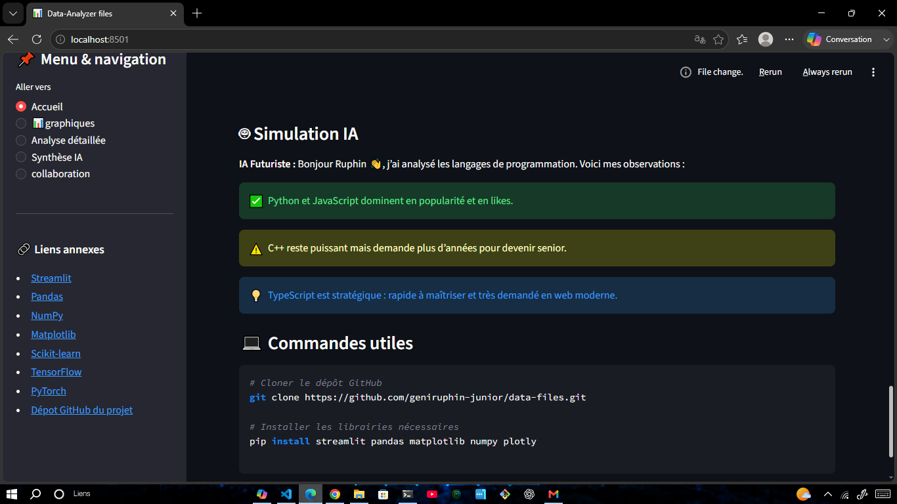

# DataAnalyzer Files 📊🤖

> _“Our ultimate mission is to connect young minds through technology, breaking barriers from the heart of Africa.”_  
> — Ruphin (13yo) & Gloire, tech dreamers from DRC 🇨🇩

---

### 🌟 The Story Behind the Code: Technology with a Heart

Hello, World! We are **Ruphin** (13 years old, creator of DevChat and Ruphia) and my best friend and coding partner, **Gloire**. We live and code in the Democratic Republic of the Congo.

**DataAnalyzer Files is not just another utility tool—it is technology built entirely from the heart.**

Despite his young age, Ruphin has already made a profound impact on his community. He successfully connected local youth and his developer group through **DevChat**, a high-performance real-time messaging application. Shortly after, he completely amazed everyone by engineering **Ruphia**, proving that age is just a number when it comes to technical execution.

Today, we are joining forces to take our vision to the corporate world. To truly empower our generation, we must master data. **DataAnalyzer Files** uses Artificial Intelligence for automated data synthesis, proving that emotional drive, technical excellence, and friendship can overcome any limitation.

🌐 **Follow our journey:** [Coming Soon / Insert your live web link here]

---

## 🖼️ Project Previews (Instant Interactive Demo)

_Note: The following previews showcase our built-in interactive demo, available on the landing page before uploading any file, designed to give users an immediate taste of the platform's power._

### 1. Main Dashboard & Quick Start


> **Pre-upload Preview:** The sleek welcome interface featuring our automated quick start guide and clean dropzone.

### 2. Futuristic AI Synthesis



> **Pre-upload Preview:** Our custom built-in AI simulation delivering multi-layered, color-coded technology summaries and live logs.

### 3. Analytics & Visual Insights


> **Pre-upload Preview:** High-speed data charts and trend lines mapping language metrics from our embedded dataset.

---

## 🚀 Key Features

- **AI-Powered Corporate Synthesis**: Tailored AI engine optimized to generate instant, human-readable summaries for business documentation.
- **Automated Data Processing**: Immediate structural text extraction and raw file parsing.
- **Futuristic UI/UX**: A cutting-edge, ultra-responsive dashboard designed to look like the future we want to build.

## ⚡ Our Next Engineering Challenges

We don't look for easy paths. Our current technical focus and upcoming updates include:

- [ ] **Native PDF Ingestion**: Building custom binary parsers to read and map text layers from heavy PDF documents.
- [ ] **Microsoft Word (.docx) Parsing**: Integrating structural XML document extraction to handle complex text flows without losing formatting.

---

## 🛠️ Tech Stack & Installation

- **Core Technologies**: Language Models (LLMs) for text synthesis, specialized structural parsing libraries, and modern frontend frameworks.

1. **Clone our dream:**
   ```bash
   git clone https://github.com
   ```
2. **Install dependencies:**
   ```bash
   pip install -r requirements
   ```
3. **Run the local server:**
   ```bash
   streamlit run app.py
   ```

---

## 👥 The Founders & Friends

- **Ruphin** – Lead Architect & Developer. Passionate about Data Science, LLMs, and changing the tech ecosystem for African youth.
- **Gloire** – Co-Developer, Partner & Brother in code. Core System Logic & Data Parsing expert.

---

## 🌍 Our Global Mission

Operating under challenging environments with limited resources, we do not build software just to solve business problems. We build to **inspire**. We code to prove to every single teenager in Africa and around the globe that with a computer, a friend, and an internet connection, you can change the world.

**_If you believe in our mission, please drop a ⭐ Star on this repository! It means the world to us._**
